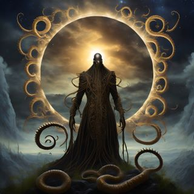

Sophia and Maya know that Peter must be in a difficult position, and they admire his bravery for speaking out against his father's plan. They quickly begin to investigate the situation, using their skills and resources to uncover the truth about Caleb's plan. They know that he has been secretly working with the Brotherhood of Eternal Night, who believe that summoning Azathoth will bring about a new era of enlightenment and prosperity for humanity. Maya and Sophia realize that they must act quickly to stop Caleb and his followers, before the upcoming annular eclipse completes its cycle. They use their skills in hacking and OSINT to gather evidence of Caleb's and the Brotherhood's plan, and they present it to the Covenant. The Covenant  are skeptical at first since they believed the Brotherhood of Eternal Night had been disbanded over one hundred years ago, but Maya and Sophia's evidence is convincing, and they soon realize the gravity of the situation. 

The Conclave of the Celestial Covenant launch a raid on Caleb's secret ritual site, just as he is about to summon Azathoth. With the ritual interrupted, Caleb and his followers are swallowed into the portal created by the ritual, closing behind them with a thunderclap knocking everyone to the ground. The world is saved from destruction, thanks to Peter's bravery and Maya and Sophia's quick thinking and expertise. However, the story doesn't end there. Caleb's followers are not easily deterred, and the Covenant now believes the members of the Brotherhood still left on Earth will continue their quest to summon Azathoth. Maya and Sophia know they must stay vigilant, and they continue to monitor the situation, ready to strike again if necessary. Maya and Sophia wrap up their report and leaving a parting comment for the reviewer's eyes only.

<!-- robots.txt -->

